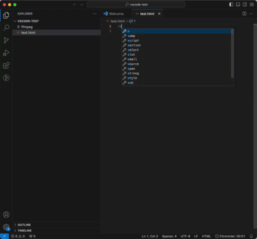

# Content Security Policy Linter

A tool designed to analyze HTML and identify potential breaches of Content Security Policy (CSP) rules. The goal is to prevent CSP violations from infiltrating your codebase.  

CSP Strict by default , it throws errors if it finds any usage of:
* inline Styles
    * ```<div style="color:blue;"></div>```
* inline javascript similar to:  
    * ```javascript:void(0)```
    * ```onclick="doSomething()"```
* Style tags without a nonce attribute
    * ```<style></style>```
* Script tags without a nonce attribute
    * ```<script></script>```




## Functionality

This Language Server works for .html, .ts and .js  files. It has the following language features:
- Diagnostics regenerated on each file change or configuration change


## Settings

It has the following configurable settings (all defaulting to false):
* allowInlineStyles: boolean,
* allowInlineJs: boolean,
* allowStyleTagWithoutNonce: boolean,
* allowScriptTagWithoutNonce: boolean,
* include:string  
    * A comma delimited string of globs to include for parsing i.e ```"**/src/**/*.html, **/src/**/*.js"```
* exlude:string
    * A comma delimtited string of globs to exclude files for parsing i.e ```"**/test/**/*.html"```
<br>

Note: All settings can be set on a user or workspace level.